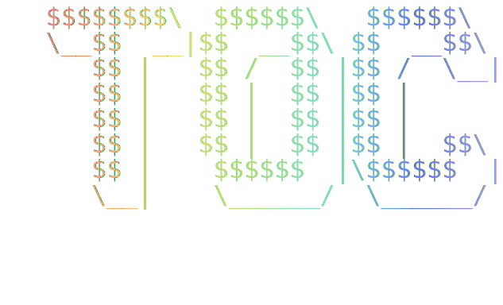

# TOC Generator

        

<p align="center">
  
</p>

An Obsidian plugin that generates a table of contents from headings in your notes using a code block syntax.

## Features

- Renders a live-updating table of contents from the current note's headings
- Configurable heading level range (H1-H6)
- Numbered (hierarchical) or bullet-style lists
- Custom bullet shapes that cycle through entries
- Character stripping from heading text
- Optional Figlet ASCII art titles (requires [Figlet Generator](https://github.com/saltyfireball/obsidian-figlet-generator) plugin)
- Fade animation on content updates
- Fully configurable code block ID and defaults via settings

## Usage

Add a code block with the configured language ID (default: `my-toc`) to any note:

````markdown
```my-toc

```
````

### Options

| Option         | Description                         | Default |
| -------------- | ----------------------------------- | ------- |
| `title`        | Text displayed above the TOC        | (none)  |
| `minLevel`     | Minimum heading level (1-6)         | 1       |
| `maxLevel`     | Maximum heading level (1-6)         | 6       |
| `numbered`     | Hierarchical numbering (true/false) | false   |
| `shapes`       | JSON array of bullet shapes         | (none)  |
| `remove_chars` | JSON array of characters to strip   | (none)  |

### Figlet Options

These require the Figlet Generator plugin to be installed. Place the text to render after a `---` separator.

| Option                | Description                    | Default  |
| --------------------- | ------------------------------ | -------- |
| `figlet-font`         | Figlet font name               | Standard |
| `figlet-color`        | Color or 'rainbow'             | inherit  |
| `figlet-colors`       | Custom gradient colors         | (none)   |
| `figlet-font-size`    | Font size in px                | 10       |
| `figlet-line-height`  | Line height                    | 1        |
| `figlet-centered`     | Center output                  | true     |
| `figlet-opacity`      | Opacity (0-1)                  | 1        |
| `figlet-multi-center` | Center each line independently | false    |

### Examples

Filtered numbered TOC:

````markdown
```my-toc
title: Table of Contents
minLevel: 2
maxLevel: 4
numbered: true
```
````

TOC with Figlet header:

````markdown
```my-toc
minLevel: 2
figlet-font: Banner
figlet-color: rainbow
---
Contents
```
````

## Settings

All defaults are configurable from the plugin settings tab:

- **Enable/Disable** the TOC processor
- **Code block ID** (default: `my-toc`)
- **Default title, heading levels, numbering, and shapes**

## Installation

### From Obsidian Community Plugins

Search for "TOC Generator" in Settings > Community plugins > Browse.

### Manual

1. Download `main.js`, `manifest.json`, and `styles.css` from the latest release
2. Create a folder `toc-generator` inside your vault's `.obsidian/plugins/` directory
3. Copy the downloaded files into that folder
4. Enable the plugin in Settings > Community plugins
