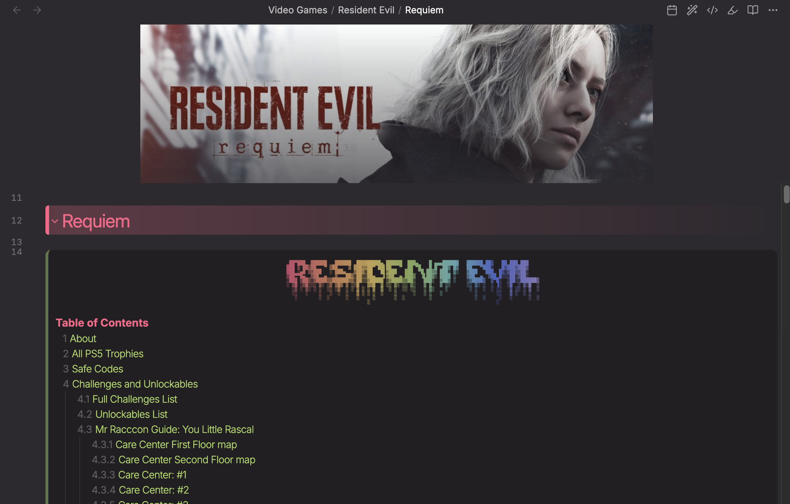
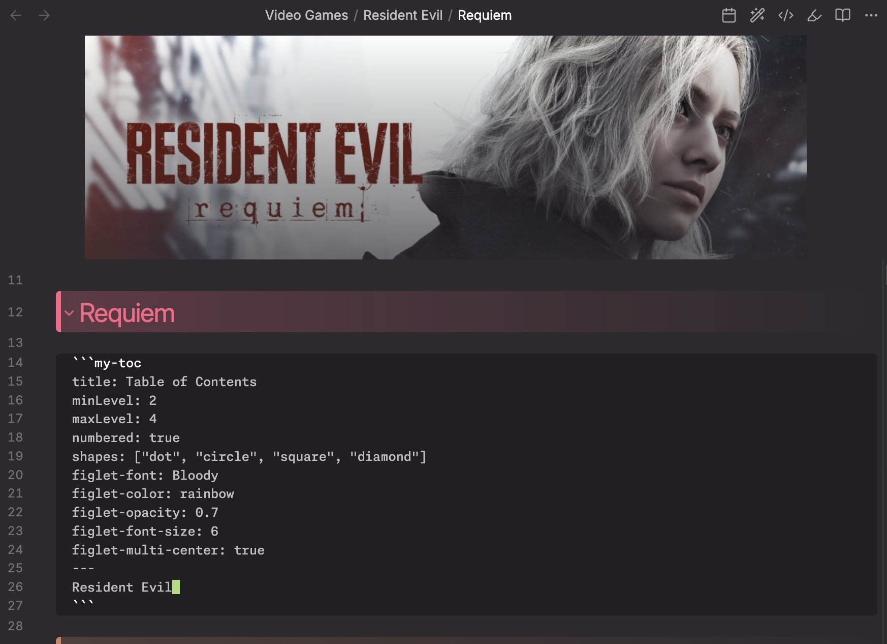
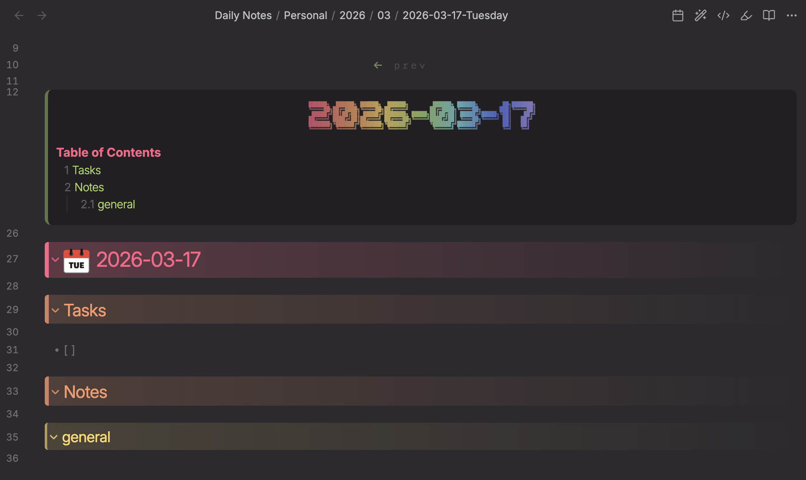

# TOC Generator

        

<p align="center">
  
</p>

An Obsidian plugin that generates a table of contents from headings in your notes using a code block syntax.

<p align="center">
  
</p>

## Features

- Renders a live-updating table of contents from the current note's headings
- Configurable heading level range (H1-H6)
- Numbered (hierarchical) or bullet-style lists
- Custom bullet shapes that cycle through entries
- Character stripping from heading text
- Optional Figlet ASCII art titles (requires [Figlet Generator](https://github.com/saltyfireball/obsidian-figlet-generator) plugin)
- **Outline panel** -- a sidebar outline view with reliable heading navigation
- **Pre-render mode** -- force all lazy-loaded content to render on note open for instant TOC/outline navigation
- Fade animation on content updates
- Fully configurable code block ID and defaults via settings

## Usage

Add a code block with the configured language ID (default: `my-toc`) to any note:

````markdown
```my-toc

```
````

### Options

| Option         | Description                                          | Default |
| -------------- | ---------------------------------------------------- | ------- |
| `title`        | Text displayed above the TOC                         | (none)  |
| `minLevel`     | Minimum heading level (1-6)                          | 1       |
| `maxLevel`     | Maximum heading level (1-6)                          | 6       |
| `numbered`     | Hierarchical numbering (true/false)                  | false   |
| `shapes`       | JSON array of bullet shapes                          | (none)  |
| `remove_chars` | JSON array of characters to strip                    | (none)  |
| `backtotop`    | Add a back-to-TOC button next to each heading (true/false) | false   |

### Figlet Options

These require the Figlet Generator plugin to be installed. Place the text to render after a `---` separator.

| Option                | Description                    | Default  |
| --------------------- | ------------------------------ | -------- |
| `figlet-font`         | Figlet font name               | Standard |
| `figlet-color`        | Color or 'rainbow'             | inherit  |
| `figlet-colors`       | Custom gradient colors         | (none)   |
| `figlet-font-size`    | Font size in px                | 10       |
| `figlet-line-height`  | Line height                    | 1        |
| `figlet-centered`     | Center output                  | true     |
| `figlet-opacity`      | Opacity (0-1)                  | 1        |
| `figlet-multi-center` | Center each line independently | false    |

### Examples

<p align="center">
  
</p>

Filtered numbered TOC:

````markdown
```my-toc
title: Table of Contents
minLevel: 2
maxLevel: 4
numbered: true
```
````

TOC with Figlet header (requires [Figlet Generator](https://github.com/saltyfireball/obsidian-figlet-generator)):

<p align="center">
  
</p>

````markdown
```my-toc
minLevel: 2
figlet-font: Banner
figlet-color: rainbow
---
Contents
```
````

## Back to TOC

Add `backtotop: true` to a TOC code block to show a small arrow button next to each heading that scrolls back to the table of contents:

````markdown
```my-toc
title: Contents
minLevel: 2
backtotop: true
```
````

- The button appears on hover (always visible on mobile)
- Only headings within the TOC's configured level range get the button
- Headings inside the TOC itself are excluded

### Embeds

When a note with `backtotop: true` is embedded in another note, the back-to-top buttons on the embedded headings scroll to the embedded note's TOC -- not the parent note's TOC. Each TOC controls only its own headings.

## Outline Panel

The plugin includes its own outline sidebar that provides reliable heading navigation in both edit and preview modes.

Open it via the command palette: **TOC Generator: Open outline panel**

The outline:
- Lists all headings from the current note with indentation by level
- Clicking a heading scrolls directly to it using line-based navigation
- Works in edit mode (live preview) and reading/preview mode
- Updates automatically when you switch notes or edit headings
- Handles special characters in headings (colons, `#`, parentheses, etc.)

## Pre-render Mode

Obsidian lazy-renders content in both reading view and live preview -- content below the fold isn't rendered until you scroll to it. This causes TOC and outline links to scroll to the wrong position on long notes with embeds, images, and other dynamic content.

Pre-render mode forces all content to load when a note opens, so navigation works instantly.

### Per-note frontmatter

Add `prerender: true` to any note's frontmatter:

```yaml
---
prerender: true
---
```

When the note opens, the plugin rapidly scrolls through the entire document behind the scenes, forcing Obsidian to render all lazy-loaded content, then returns to the original scroll position. After that, all TOC links and outline clicks land in the correct position immediately.

### Command palette

You can also trigger this on-demand without frontmatter:

**TOC Generator: Force render all content in current note**

This works in both reading view and live preview.

## Settings

All defaults are configurable from the plugin settings tab:

- **Enable/Disable** the TOC processor
- **Code block ID** (default: `my-toc`)
- **Default title, heading levels, numbering, and shapes**

## Installation

### Obsidian Community Plugin (pending)

This plugin has been submitted for review to the Obsidian community plugin directory. Once approved, you will be able to install it directly from **Settings > Community plugins > Browse** by searching for "TOC Generator".

### Using BRAT

You can install this plugin right now using the [BRAT](https://github.com/TfTHacker/obsidian42-brat) plugin:

1. Install BRAT from **Settings > Community plugins > Browse** (search for "BRAT" by TfTHacker)
2. Open the BRAT settings
3. Under the **Beta plugins** section, click **Add beta plugin**

   

4. In the overlay, enter this plugin's repository: `https://github.com/saltyfireball/obsidian-toc-generator` (or just `saltyfireball/obsidian-toc-generator`)

   

5. Leave the version set to latest

   

6. Click **Add plugin**

### Manual

1. Download the latest release from the [Releases](https://github.com/saltyfireball/obsidian-toc-generator/releases) page
2. Copy `main.js`, `manifest.json`, and `styles.css` into your vault's `.obsidian/plugins/toc-generator/` directory
3. Enable the plugin in **Settings > Community plugins**
